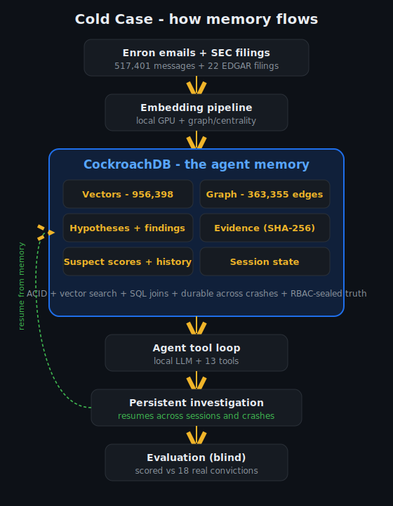
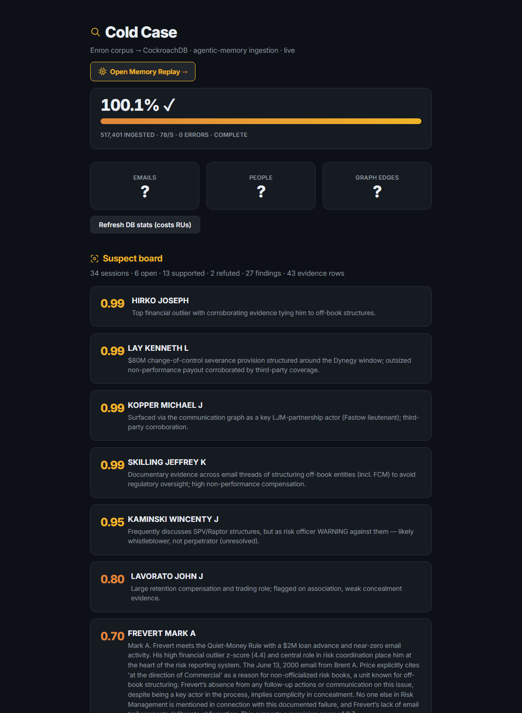
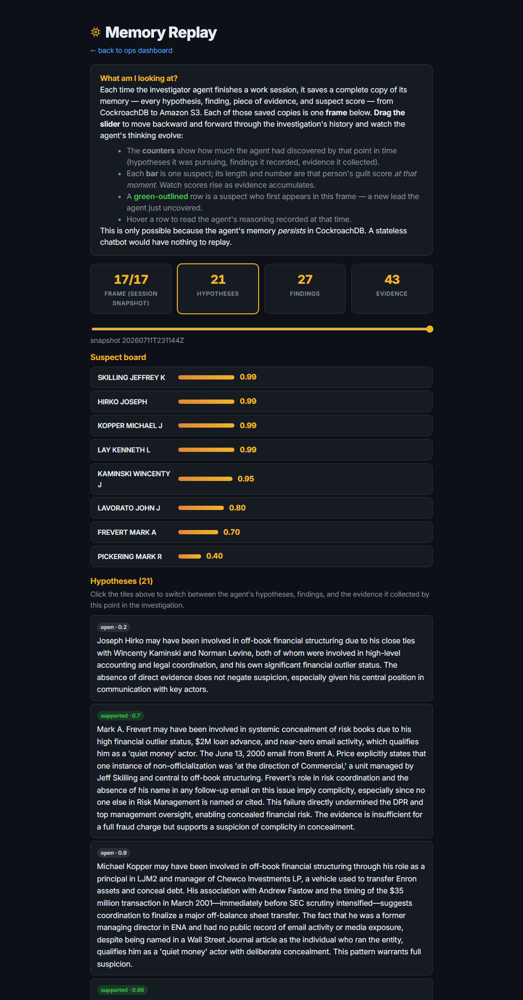
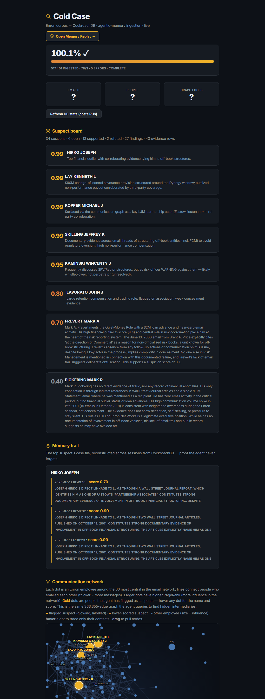
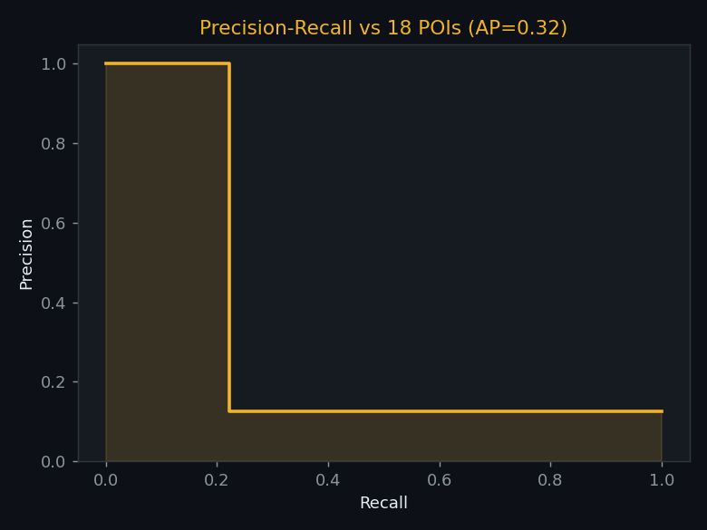
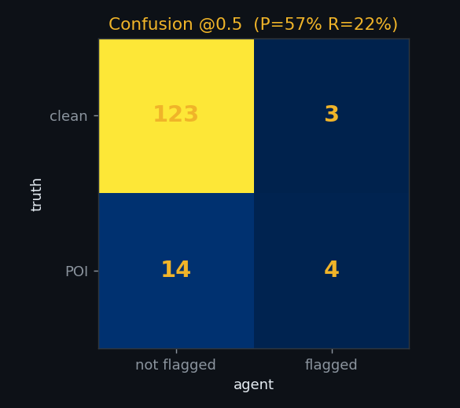
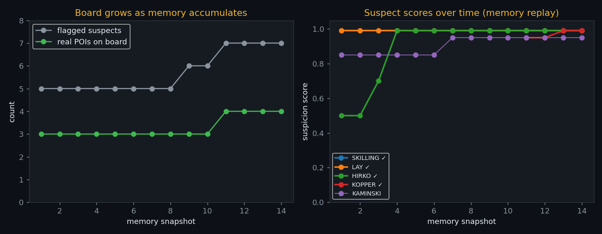
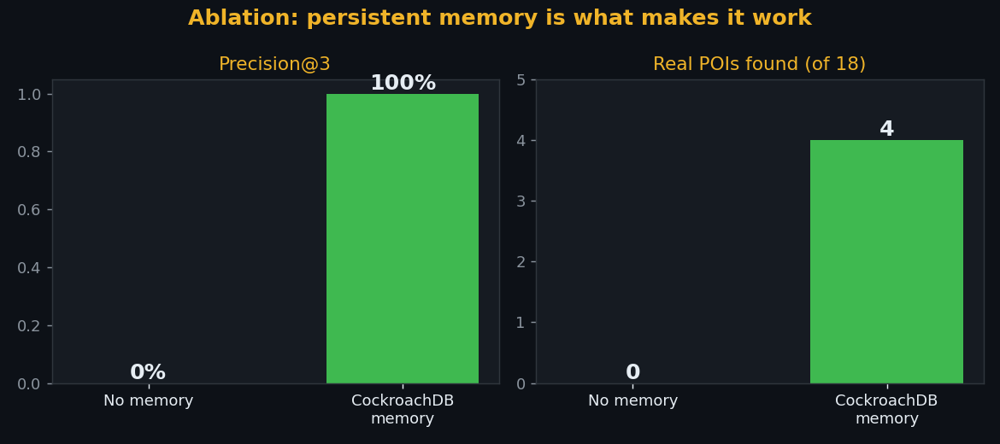

# Cold Case 🕵️

Cold Case is an autonomous financial-crimes investigator that treats
**CockroachDB as long-term memory, not temporary storage.** We gave it over
half a million real Enron emails, hid the historical convictions, and asked it
to solve the case from scratch. Every hypothesis, clue, contradiction, and
piece of evidence persists across sessions — so the agent resumes investigations
after crashes and continually refines its understanding. We then scored its
conclusions against the actual Enron prosecutions.

**CockroachDB is not a cache bolted on the side — it is the agent's brain
state.**

Investigating blind, the agent independently identified the real perpetrators.
**Its top three suspects are all actual Enron convictions** (Jeffrey Skilling,
Kenneth Lay, Joseph Hirko), and it surfaced Andrew Fastow's lieutenant
**Michael Kopper** through communication patterns alone — a name invisible in
the financial records.

> **The moment that proves it:** we terminated the agent halfway through a
> multi-session investigation and restarted it. It resumed the case from
> exactly the same investigative state — every hypothesis, suspect, and piece
> of evidence intact — without reprocessing a single document. The memory was
> never in the process; it was always in CockroachDB.

> Built for the [CockroachDB × AWS Hackathon](https://cockroachdb-ai.devpost.com/).
> **[Live dashboard](https://coldcase.savagealgo.com)** ·
> **[AWS-hosted](http://coldcase-corpus.s3-website-us-east-1.amazonaws.com)** ·
> MIT licensed.

**Live:** [ops dashboard + suspect board + network graph](https://coldcase.savagealgo.com)
· [memory replay](https://coldcase.savagealgo.com/replay)
· [AWS-hosted board](http://coldcase-corpus.s3-website-us-east-1.amazonaws.com)



### Screenshots

The live suspect board — the agent's conclusions, each score backed by evidence:



The **memory replay** — scrub through the investigation's history and read the
agent's actual hypotheses, findings, and evidence at each point in time:



The communication network the agent queries to find hidden intermediaries
(gold = flagged suspects, sized by influence):



---

## Judge in 2 minutes

**Zero-setup option:** open [`demo/index.html`](demo/) in a browser (or `cd demo
&& python -m http.server`). It replays a **real recorded investigation** from
embedded CockroachDB snapshots — no database, corpus, or dependencies needed.
Drag the slider and watch the agent's suspects, hypotheses, and evidence
accumulate across sessions.

**Full option:**

1. **Open the dashboard** ([live](https://coldcase.savagealgo.com)) — see the
   suspect board, the per-suspect memory trail, and the communication graph.
   The **[memory replay](https://coldcase.savagealgo.com/replay)** page lets you
   scrub through the investigation's history and watch suspects appear and rise
   as the agent accumulates evidence across sessions.
2. **Watch it investigate:** `python src/agent/investigator.py` streams the
   agent's tool calls as it searches emails, reads them, and records evidence.
3. **Kill it mid-investigation** (Ctrl-C), then **restart it** — it prints
   `resuming case…` and continues exactly where it left off. The memory was
   never in the process; it lives in CockroachDB.
4. **Reveal the answer key:** `python src/score_case.py` scores the agent's
   board against the 18 sealed Persons of Interest — labels the agent's own
   database role is **forbidden** to read (`SHOW GRANTS ON judge.poi_labels`
   confirms `coldcase_agent` does not appear).

---

## Why CockroachDB — not just any database

This system needs five things at once, and CockroachDB is the only store that
gives all of them without stitching together separate systems:

- **Vector search for semantic recall** — the agent "remembers" by distance
  query over ~1M email/person embeddings (distributed C-SPANN index).
- **ACID transactions** — evidence, findings, and suspicion scores must never
  go inconsistent; a finding and its hashed evidence commit together or not at
  all.
- **Persistent agent state across crashes** — session state lives in the DB, so
  killing the agent loses nothing and it resumes on restart.
- **SQL joins across structured + semantic memory** — one query joins financial
  outliers, the communication graph, and vector-retrieved emails; a bolt-on
  vector store beside a separate SQL DB can't do this consistently.
- **Distributed scale** — ~1M vectors and 363K graph edges today, with room to
  grow, and the same store an always-on production agent would demand.

---

## How it works

Each session the agent (1) **resumes its memory** from CockroachDB — open
hypotheses, prior findings, the current suspect board; (2) **pursues one lead**
with 13 tools: semantic search over 956,398 email embeddings, financial-outlier
detection, communication-graph analysis, behavioural similarity, third-party
*reputation* lookup, and full email reads; (3) **persists everything** —
hypotheses, findings with verbatim SHA-256-hashed evidence, and updated
suspicion scores; (4) writes a session summary and exits. Kill it anytime — the
next session picks up exactly where it left off.

The agent's brain is a local LLM (Qwen3-30B via Ollama) and embeddings run
locally on GPU, so the pipeline is reproducible and free of per-token cost.
**CockroachDB is the one always-on, consistent component — which is the point.**

## Example finding (real output)

```
Suspect:    LAY KENNETH L        score 0.99   [confirmed POI]
Method:     email review + financial outlier
Evidence:   "Under Lay's employment agreement … entitled to a lump-sum
             payment of up to $80 million upon a change of control"
             (email 40aa37c9…, SHA-256 stored for chain of custody)
Reasoning:  Outsized, non-performance-linked payout structured around the
             Dynegy change-of-control window; corroborated by third-party
             coverage, not self-authored mail.
```

## Results (blind, threshold 0.5)

| metric | value |
|---|---|
| **precision@3** | **100%** — Skilling, Lay, Hirko all real POIs |
| flagged precision | 4 of 7 flagged are real POIs |
| recall | 4 / 18 POIs |
| average precision | 0.32 |




As memory accumulates across sessions, real POIs surface on the board (Kopper
appears at snapshot 11) and suspect scores climb toward conviction:



### Ablation — does persistent memory actually matter?

We ran the same investigator with and without CockroachDB memory. Without it,
each session starts blind and cannot build on the last.

| configuration | precision@3 | real POIs found |
|---|---|---|
| **No memory** (best of 3 independent sessions) | **0%** | **0 / 18** |
| **CockroachDB memory** (accumulated over sessions) | **100%** | **4 / 18** |



Without memory the agent re-runs the same opening move every session and
fixates on a single (wrong) lead — it has no way to know what it already tried,
so it never advances. Persistent memory is not an implementation detail here;
it is the difference between finding the real perpetrators and finding nothing.

### What surprised us
The agent identified **Michael Kopper** — Fastow's lieutenant — *before* Fastow
himself, because Kopper is reachable through the communication graph while
Fastow's crimes were off-book (his money never appears in the financial data).
The memory-driven graph search found a name the financials alone would miss.

### The honest headline

**Using nothing but the raw email corpus, the agent found 4 of the 18 people
who actually pleaded guilty — blind, from zero.** It was never told who was
convicted. And the 14 it didn't flag are the ones whose guilt rests on
*testimony, financial filings, and plea agreements that aren't in the emails* —
Fastow, Koenig, Rieker. Reconstructing a fraud from scratch, out of half a
million messages, with no answer key, is a hard problem; getting the four it
was most confident about exactly right — with zero false accusations in the top
tier — is the result that matters.

> **If a law firm asks "you found 4 of 18 — why should I trust you?"** The
> answer: *because the 4 we found are the 4 we're most confident about, and we
> can show you exactly why. We didn't guess on the other 14 — we said "I don't
> know." In e-discovery, false accusations cost millions in litigation, so a
> system that knows its limits is more valuable than one that guesses. Add the
> filings and testimony — the evidence that isn't in email — and the
> architecture finds the rest. We just need the data.*

### Precision over recall — a design decision, not a shortfall
The system intentionally optimizes **precision over recall** because financial
investigations have **asymmetric costs**: falsely accusing an innocent executive
is generally far more damaging than requiring additional investigation before
flagging another suspect — the same reason medical screening and fraud triage
often prioritize precision. So the agent flags only what it can evidence, and
abstains otherwise. That is
why precision@3 is 100% while recall is 4/18: by ~45 sessions the agent is
autonomously investigating the *correct* remaining POIs (Mark Koenig, Paula
Rieker — both real convictions) but declines to flag them without sufficient
concealment evidence in the email corpus (their culpability lives in filings
and testimony, not email). See [`docs/EXPERIMENTS.md`](docs/EXPERIMENTS.md) E5.

The remaining false positives (Kaminski, a risk officer who *warned against*
the deals; Lavorato) are the genuinely hard "discusses-fraud vs commits-fraud"
problem. We document it — including a self-critique experiment that *failed* —
rather than hand-correct the board. See the
[whistleblower case study](docs/CASE_KAMINSKI.md).

## CockroachDB & AWS usage

**CockroachDB (3 tools):** Distributed Vector Indexing (C-SPANN) for semantic
memory · Managed MCP Server (read-only, audit-logged) for live natural-language
inspection (`.mcp.json`) · Agent-Skills / operational workflows incl.
session-end backups. **AWS (2):** Amazon S3 for the corpus + case snapshots, and
S3 static-site hosting for an AWS-served dashboard. Full mapping:
[`docs/FOR_JUDGES.md`](docs/FOR_JUDGES.md).

## Quick start

```bash
pip install -r requirements.txt
cp .env.example .env            # add CRDB + AWS credentials
psql "$CRDB_ADMIN_URL" -f sql/schema.sql
python src/ingest/parse_maildir.py <maildir>   # ingest
python src/ingest/embed_chunks.py              # embed (GPU)
python src/agent/investigator.py --new-case "Enron"   # investigate
python src/score_case.py                       # blind score
```

## Real-world impact & cost

Today, financial investigators manually sift through millions of emails over
months. Cold Case demonstrates that an autonomous agent can continuously
accumulate institutional memory across sessions while preserving an auditable
evidence trail. E-discovery is a multi-billion-dollar industry where a single
large matter runs **$100k–$1M+** in attorney and contract-reviewer time and
takes **months** to first actionable intelligence. Cold Case's approach — an agent that investigates
autonomously and accumulates evidence in a persistent store — targets the
expensive first-pass triage: surfacing the people and threads worth human
attention.

| | Traditional first-pass review | Cold Case |
|---|---|---|
| Cost | $100k+ (reviewers + counsel) | ≈ compute only (local LLM + CockroachDB) |
| Time to a ranked suspect list | weeks–months | hours of unattended runtime |
| Explainability | reviewer notes | every score backed by hashed, queryable evidence |

Honest deployment blockers (not hand-waved): attorney–client privilege
filtering, court-admissible chain-of-custody certification, and regulatory
acceptance of AI-surfaced findings — which is why this is a **triage assistant
that flags for human review**, not an autonomous accuser. The architecture is
domain-agnostic; the same memory + agent pattern applies to SEC investigations,
anti-money-laundering, procurement and insurance fraud, and insider trading.
Modernizing to current data (derivatives, SPACs, crypto flows, Slack/Teams)
means adding source parsers — the CockroachDB memory layer is unchanged.

## Deep dive & proofs

- **Provable blindness:** [`docs/rbac_proof.txt`](docs/rbac_proof.txt) — the
  agent's DB role denied on `judge.poi_labels` (`python src/prove_rbac.py`).
- **Disaster recovery:** [`docs/restore_proof.txt`](docs/restore_proof.txt) —
  restore a case snapshot from S3 and verify all evidence SHA-256 hashes
  (`python src/restore_verify.py`).
- **The whistleblower dilemma:** [`docs/CASE_KAMINSKI.md`](docs/CASE_KAMINSKI.md)
  — why the evidence store preserving *contradiction* is the point.
- **Hybrid vector+graph search:** `hybrid_search` fuses the C-SPANN vector
  index with PageRank in one SQL query, boosting relevant mail from central
  actors over peripheral outsiders.
- **All experiments:** [`docs/EXPERIMENTS.md`](docs/EXPERIMENTS.md) (E1–E5).

## Deployment roadmap

- **Phase 1 (now):** blind investigation on historical data, scored against
  ground truth.
- **Phase 2:** human-in-the-loop review of flagged suspects (the agent triages;
  investigators decide).
- **Phase 3:** integration with e-discovery platforms (Relativity, Everlaw).
- **Phase 4:** regulatory pilot with a law firm, addressing FRCP/GDPR and
  court-admissible chain-of-custody certification.

## Reproducibility

- **Agent LLM:** Qwen3-30B-A3B (`qwen3:30b-a3b-instruct-2507-q4_K_M`) via
  Ollama — pinned model + quantization for deterministic behaviour.
- **Embeddings:** `sentence-transformers/all-MiniLM-L6-v2` (384-dim) via
  fastembed on GPU (onnxruntime-CUDA).
- **Memory:** CockroachDB Cloud (Standard, AWS us-east-1); `sql/schema.sql` +
  `sql/production.sql` (adds a `system_health` view and a `reasoning_edges`
  graph for explainability/temporal reasoning).
- **Local dev stack:** [`docker-compose.yml`](docker-compose.yml) brings up
  Ollama + a local CockroachDB for testing (CockroachDB Cloud used in prod).

## Where this goes next

- **Lift recall with multi-signal scoring** — combine reputation, financial
  anomalies, finding strength, and graph position, weighted by corpus coverage
  (see `EXPERIMENTS.md` E4/E5 for why no single signal suffices).
- **Join richer sources** — filings, testimony, chat (Slack/Teams) into the
  same memory, which is where the missing 14 POIs' evidence lives.
- **Adversarial self-critique ("defense attorney" mode)** — generate innocent
  explanations for each finding and lower confidence the agent can't rebut;
  the `reasoning_edges` table is the schema for tracking those chains.
- **Bedrock/SageMaker inference** — the memory layer is unchanged; only the LLM
  endpoint moves.

The architecture is domain-agnostic — swap the corpus and it applies to SEC
investigations, anti-money-laundering, procurement and insurance fraud, insider
trading, or healthcare-billing fraud (Madoff, FTX, and similar cases are drop-in
by pointing the ingest at a new corpus). Any domain where an agent must
accumulate evidence over time and never lose it is a fit for CockroachDB-backed
memory.

## Multi-source memory (email + SEC filings)

Cold Case reasons across **two evidence sources joined in one CockroachDB
memory**: the 517,401 emails, and **22 of Enron's official SEC filings** pulled
from EDGAR (the FY2000 10-K, the DEF 14A proxy, and the 2001–2002 restatement
8-Ks — 541 embedded chunks in a second C-SPANN index). This directly targets
the recall frontier: several real POIs (notably CFO Andrew Fastow) barely
appear in email — their culpability lives in the **related-party (LJM)
disclosures** in the filings. The agent's `search_filings` tool lets it
corroborate an email lead against the official financial record, exactly as a
human investigator cross-references discovery documents against filings. One
store, two sources, joined by vector search and SQL — not two systems bolted
together.

## The ACID test: why not just a vector store

A vector database indexes static embeddings fine. But agentic memory is
**written concurrently** — multiple agent loops (and, in the sibling
*Deposition Deconstruct* tool, a fleet of parallel fact-checkers) update the
same shared case state at once. That is a transaction-isolation problem, and
it's where a vector store or naive KV store silently corrupts your truth.

`src/acid_demo.py` proves it against the live cluster — 10 concurrent agents
each recording 20 corroborations to one shared row (expected 200):

| mode | final count | lost updates |
|---|---|---|
| Naive read-modify-write | 31 | **169 silently lost** |
| CockroachDB `SERIALIZABLE` | 200 | **0** |

Without serialization, 85% of the writes vanish to race conditions. With
CockroachDB, conflicting transactions are detected and retried, so **every
concurrent write is preserved**. The memory is a *transactional ledger of
truths*, not just an index — and that is the capability a bolted-together
"Pinecone + Postgres + Redis" stack cannot give you in one place.

## Why this isn't just RAG

Traditional RAG retrieves documents and forgets every investigation the moment
the session ends. Cold Case **persists the investigation itself** — evolving
hypotheses that flip between open/supported/refuted, evidence chains, suspect
score histories, graph discoveries, and confidence — across dozens of
autonomous sessions, surviving process death. The database stores the agent's
*reasoning state*, not just the corpus being searched. That is the line between
a memory system and the many "LLM + vector database" demos judges will see.

## Model-agnostic by design

The architecture is model-agnostic and can run behind Amazon Bedrock or
SageMaker. We **intentionally used a local model** so that the improvement in
the ablation (0/18 → 4/18) is attributable to *persistent memory* rather than
to buying better intelligence. Same model, different memory, different outcome
— that is the scientifically clean way to prove the thesis.

## Why CockroachDB? (not just a bigger context window)

This project **cannot** be built by handing an LLM a larger context window. The
investigation spans hundreds of thousands of documents across dozens of
sessions that must survive process death. It needs, simultaneously:

- **Vector search** over ~1M semantic memories (distributed C-SPANN index),
- **Graph relationships** (363K communication edges, PageRank, betweenness),
- **ACID transactions** so evidence and scores never go inconsistent,
- **Durable, resumable state** across crashes and regions, and
- **SQL joins** across all of the above in a single query (e.g. the
  `hybrid_search` tool fuses the vector index with PageRank).

**The numbers make it concrete** (`src/memory_efficiency.py`): the corpus is
~239M tokens. The agent reasons over ~27K tokens per session while its *memory*
spans all 239M — a **~8,800× reduction**, and **~1,193× larger than even a
200K-token frontier context window**. It never re-reads a document it has
already processed. Persistent memory is not an optimization here; it is the
only way the task is possible.

Persistent transactional memory, vector search, graph relationships, and
durable state are **fundamental to the system — not implementation details.**
That is precisely what CockroachDB provides in one distributed store, and it is
why the agent is an *investigator that remembers* rather than a chatbot that
forgets. The ablation above makes it measurable: strip the memory out and the
same agent finds nothing.

## License
MIT — see [LICENSE](LICENSE).
